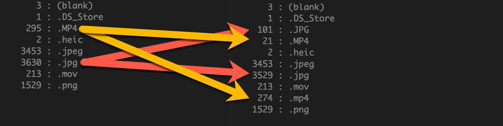

# Find File Types for NodeJS

>  The following document applies to the command-line usage of `find-file-types`.  For usage directly in a Node application, please see the [alternate README located here](README-ALT.md).

## Purpose  
Find (and optionally count) all unique file extensions within a folder or folder structure.

> More info on _why_ I created this is on my blog: [https://fredlackey.com](https://www.fredlackey.com)

## Installation

```
npm i -g find-file-types
```

## Usage

Find all unique file types...
```
find-file-types --source "/Users/Volumes/MPHD01/Multimedia"
```
... produces this:
```
(blank)
.DS_Store
.MP4
.heic
.jpeg
.jpg
.mov
.png
```
Add the `--count` switch ... 
```
find-file-types --source "/Users/Volumes/MPHD01/Multimedia" --count
```
... and you have _this_:
```
   3 : (blank)
   1 : .DS_Store
 295 : .MP4
   2 : .heic
3453 : .jpeg
3630 : .jpg
 213 : .mov
1529 : .png
```

Or, if you are _really_ anal-renentive, you could enable case sensitivity by adding `--case-sensitive` for a more granular look ...



### Parameters

| Name             | Description                        | Type            | Default |
|------------------|------------------------------------|-----------------|---------|
| `source`         | Source Directory                   | `string (path)` |         |
| `recursive`      | Locate files recursively           | `boolean`       | `true`  |
| `case-sensitive` | Match extension                    | `boolean`       | `false` |
| `count`          | Return count with list             | `boolean`       | `false` |
| `allow-blank`    | Include files without an extension | `boolean`       | `true`  |
| `limit`          | Number of files to process         | `number`        |         |

### Contact  
Please feel free to contact me directly with any questions, comments, or enhancement requests:

**Fred Lackey**  
**[fred.lackey@gmail.com](mailto://fred.lackey@gmail.com)**  
**[http://fredlackey.com](http://www.fredlackey.com)**  
